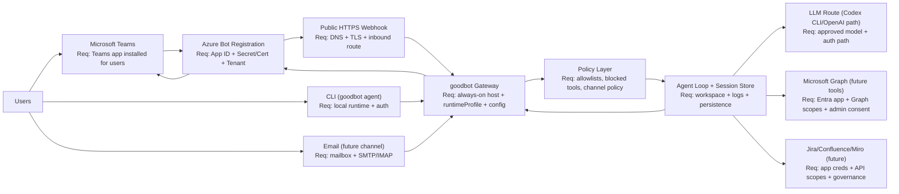

# Enterprise Integration Architecture (Draft)

This draft is intended for stakeholder alignment (Product, Infrastructure, and Security) before full connector implementation.

## 1) End-to-End Architecture

## 2) Enablement Sequence

1. Define use case and scope.
2. Complete security review (data classification, logging, retention, allowed actions).
3. Prepare infrastructure (runtime host, TLS certificate, DNS, inbound routing/egress policy).
4. Set up Azure/Entra bot identity (App ID, secret/certificate, tenant settings, Teams channel enablement).
5. Publish/install Teams app package in target scope (pilot users/team/channel).
6. Configure and run gateway with enterprise policy/profile controls.
7. Validate pilot flow and audit trail (message path, auth, logs, failure handling).
8. Expand connectors (Microsoft Graph/M365 first, then Jira/Confluence/Miro as approved).

## 3) Node Requirements

| Node | Owner (typical) | What must be enabled |
|---|---|---|
| Microsoft Teams | Collaboration / Workspace Admin | Teams app package upload + bot availability in target scopes (DM/team/channel). |
| Azure Bot Registration | Identity / Platform | Bot App ID, tenant binding, secret/certificate lifecycle, Teams channel enabled. |
| Public HTTPS Webhook | Infrastructure / Network | Reachable endpoint from Microsoft cloud, trusted TLS cert, firewall/routing rules, stable URL. |
| goodbot Gateway Runtime | Platform / App Team | Long-running process (container/VM), restart policy, secured config, observability. |
| Runtime Policy Layer | Security + App Team | Deny-by-default channel/tool policy, allowlists, profile constraints, change control. |
| Agent + Session State | App Team | Persistent workspace/state path, retention policy, incident/logging hooks. |
| LLM Route (Codex/OpenAI path) | App Team + Security | Approved model/provider path, auth mechanism, usage limits, auditability. |
| Microsoft Graph (future) | Identity / Security | Entra app registration, minimum Graph scopes, admin consent, mailbox/site scoping. |
| Jira/Confluence/Miro (future) | Tool Owners + Security | App/service account credentials, per-product scopes, data-handling approvals. |
| Email Channel (future) | Messaging Admin + Security | IMAP/SMTP connectivity, account policy approval, sender restrictions, retention controls. |

## 4) Current vs Planned Scope

- Current (implemented in fork):
  - CLI path.
  - Teams live channel MVP path (webhook-based) with gateway profile/policy controls.
- Near term (planned):
  - Teams pilot hardening (tenant rollout, stronger auth/validation, operational runbook).
  - Calendar workflow capability (availability proposal + confirmation-based booking).
- Future (planned):
  - M365/Outlook tool integration over Microsoft Graph.
  - Additional enterprise connectors (Jira, Confluence, Miro).
  - Optional additional channels such as email.

## 5) Decision Guidance

- Do not block architecture communication on full connector implementation.
- Use this draft for cross-team planning now; update it after each milestone that changes auth, routing, or required permissions.

## 6) Open Questions

- Which LLM route is approved for pilot and production: Codex CLI, OpenAI API, self-hosted model, or hybrid?
- Is outbound model traffic to external SaaS endpoints allowed for production workloads?
- For Microsoft Graph access, should we use delegated user permissions, application permissions, or a mixed approach?
- What is the approved secret lifecycle (where secrets live, who rotates them, and how often)?
- What data classes are allowed in prompts/tool payloads, and what redaction controls are required?

## 7) Decisions Needed

| ID | Decision | Candidate Options | Owner | Status |
|---|---|---|---|---|
| D-001 | LLM route for MVP and scale-out | `Codex CLI`, `OpenAI API`, `Self-hosted model`, `Hybrid with fallback` | Product + Security + Platform | Open |
| D-002 | Microsoft Graph auth model | `Delegated`, `Application`, `Hybrid` | Identity + Security | Open |
| D-004 | Public ingress pattern for Teams webhook | `Reverse proxy`, `API gateway`, `Direct service endpoint` | Infrastructure + Security | Open |
| D-005 | Prompt/data governance baseline | `Strict redaction`, `Classification-based policy`, `Channel-specific policy` | Security + Compliance | Open |
| D-006 | MVP tool scope | `Read-only calendar`, `Calendar + booking`, `Broader M365 toolset` | Product + Security | Open |
| D-007 | Observability and audit destination | `Central SIEM`, `Platform logging`, `Hybrid` | Security + Platform | Open |

## 8) Decision Log

Use this table to record architecture decisions once made.

| Date | ID | Decision | Rationale | Owner | Status |
|---|---|---|---|---|---|
| 2026-02-12 | D-008 | Pilot channels are limited to Teams + CLI | Keep MVP narrow, reduce security/infrastructure surface, and speed up stakeholder validation. | Product | Decided |
| TBD | D-001 | TBD | TBD | Product + Security + Platform | Pending |
| TBD | D-002 | TBD | TBD | Identity + Security | Pending |

## 9) Cloud Platform Deployment Details

Cloud platform ownership is expected to sit with Platform/SiteOps. Many items below may already be standardized and only need confirmation:

- Workload placement: target cluster/environment for gateway runtime and related components.
- Environment model: preview/staging/production rollout strategy and promotion gates.
- Namespace/tenancy boundaries: dedicated service boundary vs shared tenancy model.
- Ingress controls: route ownership, DNS naming, webhook path exposure, and edge protection policy.
- Runtime scale/SLO: baseline replicas, autoscaling policy, and restart/backoff settings.
- Secrets handling: central secret manager integration, ownership, rotation cadence, and break-glass process.
- Observability: logging/metrics/tracing destinations, required fields, retention, and alerting expectations.
- GitOps/change controls: deployment repository layout, ownership model, and approval workflow.
